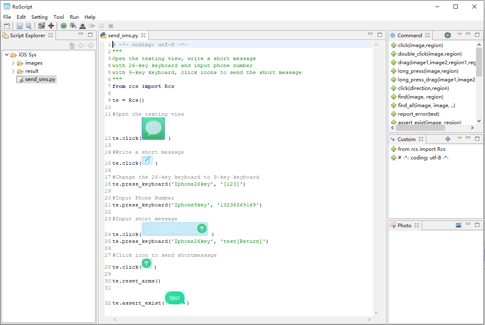
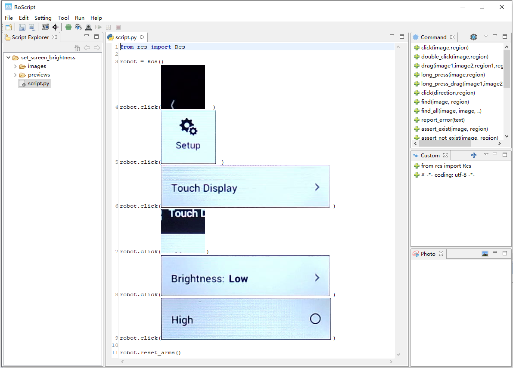

## The RoScript Tool Evaluation Data

This is a repository of artifacts for ICSE2020 paper:  
```Ju Qian, Zhengyu Shang, Shuoyan Yan, Yan Wang, Lin Chen. RoScript: A Visual Script Driven Truly Non-Intrusive Robotic Testing System for Touch Screen  Applications. International Conference on Software Engineering (ICSE), 2020.```

### Demo

#### 1. Test Engine
Folder `Demo\Engine` contains a demonstration test script used to validate the RoScript test engine.
	
	+ Demo\Engine\Iphone5S\iOS-Sys        
	  - images                       # the widget images
	  - result                       # some runtime images
	  - send_sms.py                  # the test script
	  - send_sms.png                 # a graphical view of the test script



#### 2. Test Script Recorder

Folder `Demo\Record` contains a demonstration that accurately records the click actions in a video into a test script.
	
	+ Demo\Record\GoPro\GoPro
	  + set_screen_brightness       
		- images                     # the widget images
		- previews                   # pre-action frames in the video
		- script.png                 # a graphical view of the recorded test script
		- script.py                  # the recorded test script
		- set_screen_brightness.avi  # the human action video




### Artifacts Used in the Experiment  

* The test scripts used to validate the test engine.[ ```link```.](https://pan.nuaa.edu.cn/share/02012411bd6fa153cbf2b971fa?lang=en)  
* The videos used to validate the script recorder (4.5GB) [ ```link```.](https://pan.nuaa.edu.cn/share/9df3c413946850948b71a1f2ea?lang=en)  


